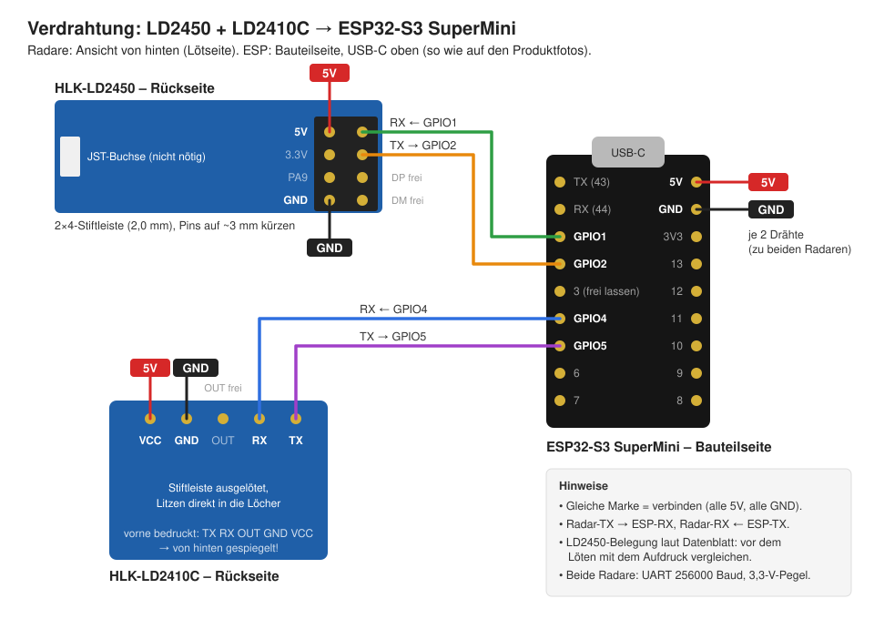
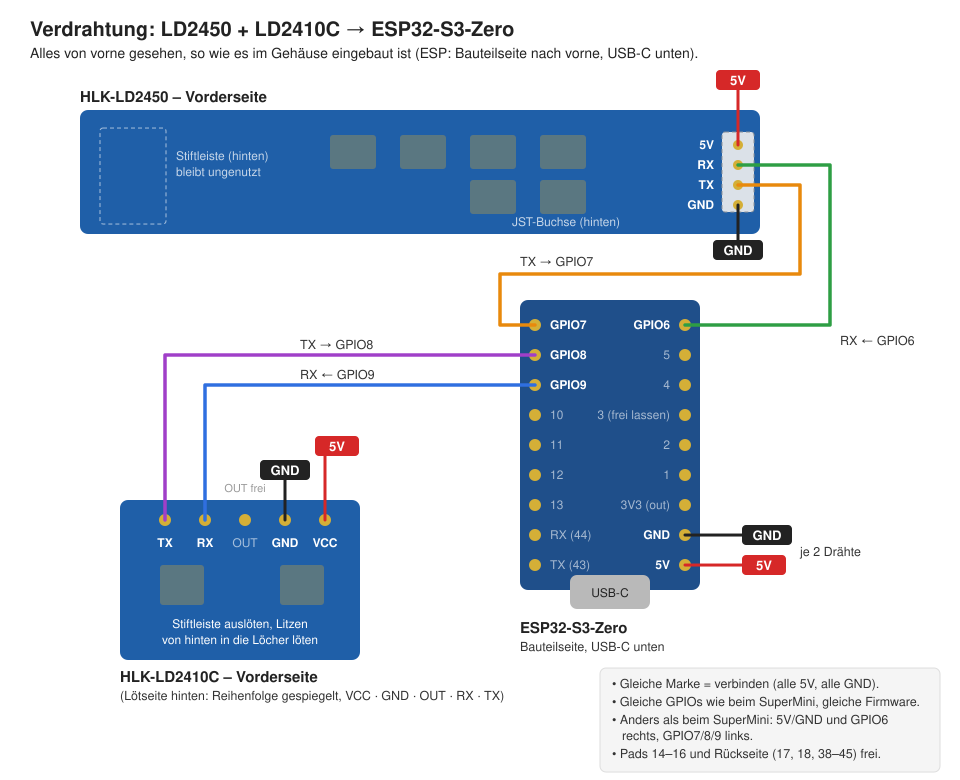

# Kombi-Präsenzsensor LD2450 + LD2410C – Gehäuse

Schmales, hochkantes Gehäuse (30,2 × 77,8 × 16 mm) für beide Radare und einen ESP32-S3/C3 SuperMini oder einen Waveshare ESP32-S3-Zero.
Die untere Tasche ist für den **LD2410C** ausgelegt. Mit `static_radar = "LD2412"` in der `.scad`-Datei
wird sie für den LD2412 umgebaut (dann 34,1 × 72,8 mm).

**Anordnung** (wie beim Apollo R PRO-1):

- **LD2450 hochkant** (lange Seite senkrecht) an der rechten Wand, JST-Buchse unten. Nur so misst er den
  Winkel in der Waagerechten, also links/rechts im Raum.
- **LD2410C quer** darunter, also um 90° zum LD2450 gedreht. Patch-Antennen sind linear polarisiert;
  gekreuzt sehen sich die beiden Radare deutlich schwächer (Ziel: weniger Fehlerkennungen beim LD2410C).
- Dazwischen 11,6 mm Abstand von Platinenkante zu Platinenkante (Raum für den JST-Stecker) und eine
  **Trennrippe mit Schlitz** für ein optionales Abschirmblech, siehe unten.
- Die Platinen werden wie bisher gehalten: dieselben Taschen, Federstege, Rastnasen und Ausbrech-Säulen,
  die LD2450-Tasche ist nur gedreht.
Der Sensor wird auf einen Halter geschoben (Schwalbenschwanz):

- **Eckhalter** (`stl/corner.stl`): Keil für die Raumecke, der Sensor schaut diagonal in den Raum. Die Spitze des Keils
  ist abgeflacht: Echte Ecken sind durch Putz oder Acrylfuge leicht gerundet, bis 6 mm Radius liegt der Halter
  trotzdem mit beiden Flächen an der Wand an (`corner_r` in der `.scad`-Datei).
- **Schrankfuß** (`stl/stand.stl`): um 10° nach unten geneigt. `stl/stand_flat.stl` ist dieselbe Form ohne Neigung.
  Beide werden auf den Schrank geklebt (doppelseitiges Klebeband). Unter dem Sensor sind 20 mm frei für einen
  gewinkelten USB-C-Stecker (Kopf bis 18 mm), das Kabel läuft durch einen 10 × 10 mm großen Tunnel unter dem Fuß nach hinten.

Quelle: `radar-combo-case.scad` (OpenSCAD). Alle Maße sind oben als Parameter änderbar.

## Druck

| Teil | Lage | Hinweis |
|---|---|---|
| `shell.stl` | Front nach unten | Front nur 0,6 mm (Radom, 3 Schichten à 0,2 mm), keine Stützen |
| `lid.stl` | Rückseite nach unten | für den SuperMini; Nut und Senkungen druckbar ohne Stützen |
| `lid_s3zero.stl` | Rückseite nach unten | dasselbe für den ESP32-S3-Zero |
| `corner.stl` | stehend | – |
| `test_beams.stl` | Front nach unten | Teststück für Federstege, Radar-Taschen und Trennrippe |
| `stand.stl`, `stand_flat.stl` | auf der Bodenplatte | Tunnel oben 10 mm Brücke |

PLA in Wandfarbe, 0,2 mm Schicht. **Stützstrukturen aus** (oder „nur auf der Druckplatte“), sonst füllt der Slicer den Spalt unter den Federstegen. Die Federstege der beiden Radar-Taschen werden als Brücke 1 mm über der Front gedruckt; sie dürfen nicht mit der Front verkleben, sonst federn sie nicht. Lüfter 100 %, Brücken-Umfänge erkennen an.

**Nach dem Druck:** Unter dem LD2450-Federsteg (links neben dem LD2450) sitzen vier kleine Säulen, die nur die Brücke beim Drucken stützen. Vor dem Einsetzen des LD2450 herausbrechen: den Steg an jeder Säule mit einem kleinen Schraubendreher nach links (weg vom LD2450) drücken, bis die Säule abreißt. Erst danach federt der Steg über seine ganze Länge.
Genauso unter dem LD2410C-Federsteg (zwei Säulen) und im **Deckel** unter dem ESP-Federsteg (drei Säulen): den Steg an jeder Säule mit einem kleinen Schraubendreher vom ESP weg drücken, bis sie abreißt.

**Teststück zuerst:** `stl/test_beams.stl` ist nur die Front mit beiden Taschen, Federstegen und Rastnasen (Wände gekürzt, etwa 15 Minuten Druck). Damit prüfen, ob die Stege frei sind und beide Radare einrasten, bevor das ganze Gehäuse gedruckt wird. **Kein Silk-, Metallic- oder Carbon-Filament**, das dämpft das Radar.
Maße stammen aus den Hi-Link-Datenblättern. Beim JST-Stecker und beim ESP-Board sind es Schätzwerte.
Druck zuerst `shell.stl` und prüf die Passung.

## Teile

- HLK-LD2450, HLK-LD2410C, ESP32-S3 SuperMini (C3 SuperMini passt auch) oder ESP32-S3-Zero (eigener Deckel)
- dünne Litze (28–30 AWG) für den LD2410C
- 2× M2×10 Senkkopf, selbstschneidend (Deckel). Der Deckel hat Durchgangslöcher (Ø 2,6), das Gewinde greift nur im Dom (Ø 2,0). Nicht mit Gewalt anziehen.
- Eckhalter: 2 Schrauben 3–3,5 mm (Kopf bis Ø 7,5 mm, mind. 30 mm lang) + Dübel, oder doppelseitiges Klebeband
- Schrankfuß: ein **gewinkeltes USB-C-Kabel** (90°, Kopf höchstens 18 mm hoch), damit das Kabel unter dem
  Sensor nach hinten abgeht. Den Stecker so herum einstecken, dass das Kabel nach hinten zeigt (USB-C ist
  verdrehsicher, beide Lagen passen). Ein gerader Stecker passt nicht.

## Verkabelung (ESP32-S3 SuperMini)

| Radar | Radar-Pin | ESP32-S3 | ESPHome |
|---|---|---|---|
| LD2450 (JST) | 5V / GND | 5V / GND | – |
| LD2450 (JST) | RX ← | GPIO6 | `tx_pin: GPIO6` |
| LD2450 (JST) | TX → | GPIO7 | `rx_pin: GPIO7` |
| LD2410C | VCC / GND | 5V / GND | – |
| LD2410C | RX ← | GPIO9 | `tx_pin: GPIO9` |
| LD2410C | TX → | GPIO8 | `rx_pin: GPIO8` |

Die Pins sind so gewählt, dass die Drähte im Gehäuse kurz bleiben: Die JST-Buchse des LD2450 sitzt
(von vorne gesehen) rechts der Mitte direkt über dem ESP, auf der Seite von GPIO6/7. Die Lötlöcher des LD2410C (TX/RX) liegen nah bei GPIO8/9.
Am ESP-Pin 5V und GND kommen je zwei Drähte an, einer zu jedem Radar.

LD2450-Anschluss: **JST-ZH-Kabel (1,5 mm Raster, 4-polig)**, Belegung an der Buchse von oben: 5V · RX · TX · GND
(laut Datenblatt, mit dem Aufdruck vergleichen). Nach Position anschließen, die Kabelfarben sind nicht genormt.
Die 2×4-Stiftleiste auf der Rückseite bleibt ungenutzt und darf drauf bleiben. Ohne JST-Kabel geht auch sie
(5V · 3.3V · PA9 · GND | RX · TX · DP · DM): Pins kürzen und Litzen an die Pins löten, Auslöten ist nicht nötig.

Der LD2410C ist vorne mit TX · RX · OUT · GND · VCC bedruckt, von hinten (Lötseite) ist die Reihenfolge gespiegelt. OUT bleibt frei.

Beim S3 lassen sich die UARTs auf beliebige GPIOs legen. GPIO0, 3, 45 und 46 meiden, das sind Strapping-Pins.
Die Logs laufen über USB, ein dritter UART bleibt frei.
Baudrate: LD2450 und LD2410C 256000 (ein LD2412 hätte laut Datenblatt 115200).

## Verkabelung (ESP32-S3-Zero)

Der Waveshare ESP32-S3-Zero (ESP32-S3FH4R2, 4 MB Flash) läuft mit derselben Firmware und denselben GPIOs
wie in der Tabelle oben. Nur die Lage der Pins ist eine andere: Von vorne mit USB-C unten gesehen liegen
5V, GND und GPIO6 rechts, GPIO7, 8 und 9 links. Nicht nach der Position aus dem SuperMini-Bild löten.
Die Pads 14–16 an der Unterkante und die Pads auf der Rückseite bleiben frei, die RGB-LED hängt an GPIO21.
Der Zero braucht den Deckel `lid_s3zero.stl`. Gemessen ist er 24,1 mm lang (ohne Buchse), der Deckel ist aber
für 23,1 mm ausgelegt (1 mm kürzer), also nur 0,1 mm länger als für den SuperMini. Federsteg und Rastnase sitzen entsprechend höher. Nicht geprüft ist, ob am oberen Ende links der
Mitte (x = −6 … −2 mm), wo die Rastnase aufliegt, Bauteile oder die Antenne sitzen.

## Zusammenbau

1. LD2450: JST-ZH-Kabel in die Buchse stecken, die Stiftleiste bleibt ungenutzt. Den Radar hochkant mit den goldenen Antennen nach vorne und der Buchse **unten** einsetzen: zuerst die rechte Längskante unter die festen Nasen an der rechten Gehäusewand schieben, dann die linke Kante über die Nasen auf dem federnden Steg drücken. Unter dem Radar ist Platz für den Stecker. Das Kabel dort nach hinten biegen und rechts am ESP vorbei führen; links der Mitte sitzt die WLAN-Antenne des ESP.
2. LD2410C: Die eingelötete 5-polige Stiftleiste **muss ab** (auslöten, oder den Kunststoff aufschneiden und die Pins einzeln ziehen). Hinter dem LD2410C sitzt der ESP mit nur etwa 3 mm Abstand. Dann 4 dünne Litzen (VCC, GND, TX, RX) von hinten in die Lötlöcher an der Oberkante löten und flach zur Seite wegführen. Dann den Radar mit den Antennen nach vorne einsetzen, die Lötlöcher oben: zuerst die Unterkante unter die festen Nasen am Boden schieben, dann die Oberkante über die Nasen auf dem federnden Steg drücken.
3. Alle Kabel an den ESP löten. Den ESP wie die Radare einsetzen, Bauteilseite zum Radar, USB-C nach unten: zuerst das USB-Ende schräg über die beiden festen Keilnasen neben der Buchse auf die Deckelnase setzen, dann das obere Ende auf die Schienen drücken, bis es unter der Rastnase am Federsteg einrastet. Ausgelegt für eine 1,65 mm dicke Platine. Die seitlichen Führungen halten den ESP seitlich. Ein Streifen doppelseitiges Klebeband auf den Schienen ist optional, ein Stück Kapton-Band hinten auf dem LD2410C schützt zusätzlich vor Kurzschluss.
4. Optional: Abschirmblech in den Schlitz der Trennrippe zwischen den Radaren stecken (siehe unten).
5. Deckel einsetzen (die USB-Buchse gleitet in den Ausschnitt unten) und mit 2× M2 verschrauben. Beide Schrauben sitzen links neben dem LD2450.
6. Halter montieren und den Sensor von oben aufschieben. Beim Eckhalter sitzt pro Wand eine Schraube, die senkrecht in die Wand geht: unten unter der Schiene in die rechte Wand, oben über der Schiene in die linke. Den Schraubendreher schräg von vorne ansetzen.

Bei Bedarf ein Tropfen Heißkleber am Platinenrand, falls ein Radar wackelt.

Montagehöhe laut Datenblatt: 1,5–2 m.

**Nach dem Einbau x prüfen:** Von vorne gesehen nach links gehen. Das Vorzeichen von x hängt davon ab, wie herum der LD2450
hochkant sitzt (Buchse oben oder unten). Ist links und rechts vertauscht, x im Tracker spiegeln.

## Störungen zwischen den Radaren

LD2450 und LD2410C senden beide im 24-GHz-Band. Der LD2450 strahlt in den LD2410C ein, und der meldet dann Bewegung, wo keine ist.
Dagegen hilft im Gehäuse:

1. **Gekreuzte Lage** (90°): Gleich polarisierte Patch-Antennen koppeln stark, gekreuzte schwach.
2. **Abstand**: Platinenkanten 11,6 mm auseinander statt wie bisher ca. 2 mm.
3. **Abschirmblech (optional)**: Die Trennrippe hat einen 0,6-mm-Schlitz bis auf das Radom. Ein Streifen Alublech
   (0,1–0,3 mm, z. B. aus einer Getränkedose) oder doppelt gefaltetes Kupferband, ca. 4 × 27 mm, blockiert den direkten Weg
   entlang der Front. Es liegt etwa 3 mm vor der WLAN-Antenne des ESP. Nach dem Einbau die WLAN-Signalstärke prüfen.

**Vor dem Druck kurz testen**, ob die gekreuzte Lage beim eigenen Exemplar hilft. Welche Polarisation die Module haben,
steht in keinem Datenblatt. LD2410 Engineering Mode einschalten, Raum leer, die Gate-Energien (`LD2410 Gx Move/Still Energy`)
beobachten. Den LD2450 dabei nacheinander 1) abstecken, 2) quer und 3) hochkant 1–2 cm über den LD2410C halten. Ist 3) deutlich
ruhiger als 2) und nah an 1), passt die Anordnung. Wenn nicht, müsste der LD2410C ebenfalls hochkant.
